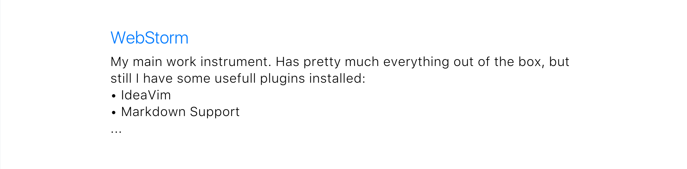
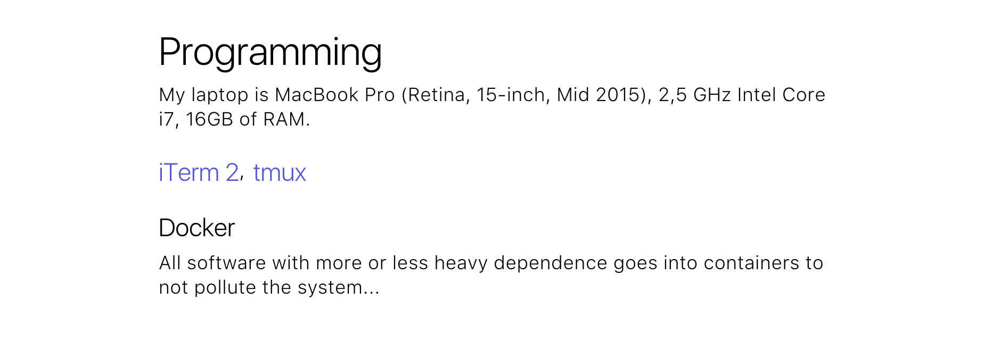

### Works For Me

A nice way to discover new tools and share ones which work for you. 

All contributed setups are compiled to [Works For Me site](https://works-for-me.github.io).<br>
Try [the Playground](https://works-for-me.github.io/playground/playground.html) to see how your setup will look like.<br>
Subscribe to [RSS-feed](https://works-for-me.github.io/rss.xml) to get new setups and updates to existing ones.

## Index

- [How to add my setup?](#how-to-add-my-setup)
- [Setup structure](#setup-structure)
- [What goes to RSS-feed](#what-goes-to-rss-feed)

## How to add my setup?

1. Fork  [original repository](https://github.com/nik-garmash/works-for-me)
1. Create a new file within `setups/` folder and describe your setup there
1. Make a Pull Request

## Setup structure

Start with little information about you.
Essentially, only name is required to make sense.

```
name: John 🚀 Doe
occupation: Software Engineer 
location: Berlin, Germany
link: https://www.google.com/search?q=john+doe
```


 

Add your tools.

```
> WebStorm (https://www.jetbrains.com/webstorm/)

My main work instrument.
Has pretty much everything out of the box, but still I have some usefull plugins installed:
• IdeaVim
• Markdown Support
...
```




Optionally add grouping titles.

```
-- Programming

My laptop is MacBook Pro (Retina, 15-inch, Mid 2015), 2,5 GHz Intel Core i7, 16GB of RAM.

> iTerm 2 (https://www.iterm2.com/), tmux (https://tmux.github.io/)

> Docker

All software with more or less heavy dependence goes into containers to not pollute the system...
```



You can leave a comment inside setup.
```
// Add some description...
```

Such line won't be rendered.

## What goes to RSS-feed

RSS-feed is based on commit-messages.

If you are about to commit new setup start commit-message with `new: `

```
new: John Doe (Software Engineer)
```

You can add a few words about you, commit-message goes to the feed.

For major updates to existing setup, use `update: `, that also goes to RSS.

```
update: Changed IDE
```

If you want to fix some typos or make minor chages, use `fix: `, no-one will see that one.

```
fix: Fixing typos
```
